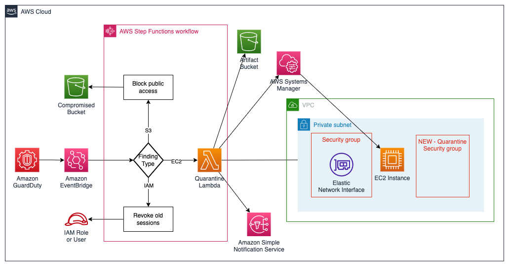

# Automated GuardDuty Security Response

## 🚨🚨🚨 DISCLAIMER 🚨🚨🚨

This project, when deployed in an AWS account, will break your application if [Amazon GuardDuty](https://aws.amazon.com/guardduty/) detects activity related to running EC2 instances, IAM credentials or S3 buckets. This is by design. Using Amazon GuardDuty, this project will monitor for malicious activity occuring in your account and automatically respond by doing the following:

- If Amazon GuardDuty detects activity on publicly readable S3 buckets, this project will [block public access to S3](https://docs.aws.amazon.com/AmazonS3/latest/userguide/access-control-block-public-access.html)
- If Amazon GuardDuty detects activity on IAM principles, this project will [revoke any active sessions](https://docs.aws.amazon.com/IAM/latest/UserGuide/id_roles_use_revoke-sessions.html).
- If Amazon GuardDuty detects activity on EC2 instances, this project will isolate and quarantine the instance (blocking all traffic to the instance)

Amazon GuardDuty is a regional service, so this project will only monitor resources in the AWS region in which it is deployed.

This project is intended to reduce the blast radius caused by a security event by isolating and quarantining instances as soon as they are detected. No resources are destroyed, so if the event is deemed a false positive, service can be restored.

### Table of contents

1. [Introduction](#introduction)
2. [Architecture](#architecture)
3. [Prerequisites](#prerequisites)
4. [Tools and services](#tools-and-services)
5. [Usage](#usage)
6. [Clean up](#clean-up)
7. [Reference](#reference)
8. [Contributing](#contributing)
9. [License](#license)

## Introduction

This project will set up an automated response workflow for [Amazon GuardDuty](https://aws.amazon.com/guardduty/) findings. Currently, [EC2 finding types](https://docs.aws.amazon.com/guardduty/latest/ug/guardduty_finding-types-ec2.html), a subset of [S3 finding types](https://docs.aws.amazon.com/guardduty/latest/ug/guardduty_finding-types-s3.html) and [IAM finding types](https://docs.aws.amazon.com/guardduty/latest/ug/guardduty_finding-types-iam.html) targeting an `IAMUser` or `AssumedRole` are supported.

#### EC2 Finding Types

When an EC2 finding is detected, [AWS Step Functions](https://aws.amazon.com/step-functions/) is used to execute an [AWS Lambda](https://aws.amazon.com/lambda/) function to gather information and quarantine the EC2 instance:

1. Grabs a screenshot from the instance and uploads it to S3
2. Captures metadata about the instance and uploads it to S3
3. Enables termination protection on the instance
4. Ensure Instance Shutdown Behavior is set to “Stop”
5. Disable the “DeleteOnTermination” setting for All Attached Volumes
6. Tag the instance
7. Creates a snapshot of any attached EBS volumes
8. Acquire Instance memory (write directly to S3, if possible) [*NOTE*: Not yet supported]
9. Removes any existing IAM instance profiles
10. Attaches a new IAM instance profile with [AWS Systems Manager Session Manager](https://docs.aws.amazon.com/systems-manager/latest/userguide/session-manager.html) (SSM) access
11. Execute data gathering commands on the instance and upload results to S3 via SSM
12. Detach the instance from EC2 autoscaling groups (if applicable)
13. Deregister Instance from Load Balancers (if applicable)
14. For each [Elastic Network Interface](https://docs.aws.amazon.com/AWSEC2/latest/UserGuide/using-eni.html) (ENI), create a new isolated [security group](https://docs.aws.amazon.com/vpc/latest/userguide/VPC_SecurityGroups.html) in the ENI's VPC and update the existing ENI's to use new security groups

#### S3 Finding Types

When an S3 finding is detected, if the effective permissions of the bucket are `PUBLIC` (we are assuming that all buckets should be private in this environment), [AWS Step Functions](https://aws.amazon.com/step-functions/) will call the S3 [PutPublicAccessBlock](https://docs.aws.amazon.com/AmazonS3/latest/API/API_PutPublicAccessBlock.html) API to make the bucket private.

#### IAM Finding Types

When an IAM finding is detected, if the identity type is `IAMUser`, Step Functions attaches a policy named `AWSRevokeOlderSessions` to the IAM user to revoke any active sessions. If the identity type is `AssumedRole`, Step Functions attaches a policy named [AWSRevokeOlderSessions](https://docs.aws.amazon.com/IAM/latest/UserGuide/id_roles_use_revoke-sessions.html) to the IAM role to revoke any active sessions.

## Architecture



## Prerequisites

- [Python 3](https://www.python.org/downloads/), installed
- [AWS Command Line Interface (AWS CLI)](https://docs.aws.amazon.com/cli/latest/userguide/install-cliv2.html) version 2, installed
- [AWS Serverless Application Model (SAM)](https://docs.aws.amazon.com/serverless-application-model/latest/developerguide/serverless-getting-started.html), installed
- [Docker Desktop](https://www.docker.com/products/docker-desktop), installed

## Tools and services

- [AWS Lambda](https://aws.amazon.com/lambda/) - AWS Lambda is a serverless compute service that lets you run code without provisioning or managing servers, creating workload-aware cluster scaling logic, maintaining event integrations, or managing runtimes.
- [Amazon GuardDuty](https://aws.amazon.com/guardduty/) - Amazon GuardDuty is a threat detection service that continuously monitors your AWS accounts and workloads for malicious activity and delivers detailed security findings for visibility and remediation.
- [AWS Step Functions](https://aws.amazon.com/step-functions/) - AWS Step Functions is a low-code, visual workflow service that developers use to build distributed applications, automate IT and business processes, and build data and machine learning pipelines using AWS services.
- [Amazon EventBridge](https://aws.amazon.com/eventbridge/) - Amazon EventBridge is a serverless event bus that makes it easier to build event-driven applications at scale using events generated from your applications, integrated Software-as-a-Service (SaaS) applications, and AWS services.
- [AWS Systems Manager Session Manager](https://docs.aws.amazon.com/systems-manager/latest/userguide/session-manager.html) - Session Manager provides secure and auditable node management without the need to open inbound ports, maintain bastion hosts, or manage SSH keys.

## Usage

#### Parameters

| Parameter  |  Type  |                  Default                   | Description                     |
| ---------- | :----: | :----------------------------------------: | ------------------------------- |
| GitHubOrg  | String |                aws-samples                 | Source code GitHub organization |
| GitHubRepo | String | amazon-guardduty-automated-response-sample | Source code GitHub repository   |

#### Installation

The CloudFormation stack must be deployed in the same AWS account and region where a GuardDuty detector has been configured and your EC2 instances are running.

```
git clone https://github.com/aws-samples/amazon-guardduty-automated-response-sample
cd amazon-guardduty-automated-response-sample
sam build
sam deploy \
  --guided \
  --tags "GITHUB_ORG=aws-samples GITHUB_REPO=amazon-guardduty-automated-response-sample"
```

## Clean up

Deleting the CloudFormation Stack will remove the Lambda functions, state machine and EventBridge rules.

```
sam delete
```

## Reference

This solution is inspired by these references:

- [Startup Security: Techniques to Stay Secure while Building Quickly](https://catalog.workshops.aws/startup-security-stay-secure-while-building-quickly/en-US) (workshop)
- [AWS Security Hub Automated Response and Remediation](https://aws.amazon.com/solutions/implementations/aws-security-hub-automated-response-and-remediation/) (AWS SHARR)
- [How to automate incident response in the AWS Cloud for EC2 instances](https://aws.amazon.com/blogs/security/how-to-automate-incident-response-in-aws-cloud-for-ec2-instances/)
- [Automated security orchestrator with AWS Step Functions](https://github.com/aws-samples/automating-a-security-incident-with-step-functions)
- [Auto Cloud Digital Forensics Incident Response (DFIR)](https://github.com/aws-samples/auto-cloud-digital-forensics-incident-response)
- [AWS Incident Response Playbook Samples](https://github.com/aws-samples/aws-incident-response-playbooks)

## Contributing

See [CONTRIBUTING](CONTRIBUTING.md#security-issue-notifications) for more information.

## License

This library is licensed under the MIT-0 License. See the [LICENSE](LICENSE) file.
